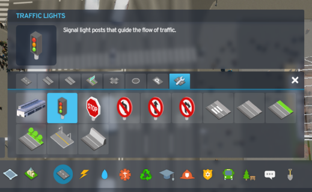
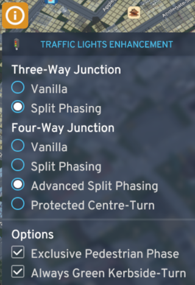

> [!NOTE]
> Currently, the mod only supports three-way and four-way junctions. Junctions of other types will behave like those in the vanilla game, with an added feature: pedestrians will have an exclusive phase if enabled.

> [!TIP]
> The mod modifies only the sequencing of signals, not their duration. The base game's *smart* traffic lights extend green lights if traffic is still flowing, signal timing is not altered by this mod currently.

## Introduction
This mod introduces advanced traffic light controls for Cities: Skylines 2, allowing for more efficient traffic management. It supports both Right-Hand Traffic (RHT) and Left-Hand Traffic (LHT).

## Modes

| Mode[^1] | Description |
| --- | --- |
| Vanilla | Operates like the base game. LHT: protected straight, protected left, and permissive right. RHT: protected straight, protected right, and permissive left. |
| Split-Phasing | Only one road has a green light at a time. |
| Advanced Split Phasing | Similar to Split Phasing, with additional protected turns for the other road at the same time.[^2] |
| Protected Centre-Turn | LHT: Centre lanes perform a protected left turn first, followed by normal traffic flow including straight and right turns. RHT: Centre lanes perform a protected right turn first, followed by normal traffic flow including straight and left turns. [Video Illustration](https://www.youtube.com/watch?v=CIw0Au8qFQ8) |

## Options

| Option | Description |
| --- | --- |
| Exclusive Pedestrian Phase | A dedicated phase for pedestrian crossings, stopping all vehicular traffic. |
| Always Green Kerbside-Turn (Allow turn on red) | LHT: always-green left turn. RHT: always-green right turn. |

![WARNING] There may be pedestrian pathfinding issues at junctions, potentially indicating a bug in the game's node or pathfinding system, not addressed by this mod.

## How To Use

| | |
|-|-|
| Open the Roads Tool, switch to the Road Services tab, and select "Traffic Lights" |  |
| A small window should appear in the top-left corner of your screen   1. Select the signal mode you prefer  2. Move your cursor to any existing junction and press the left mouse button, just like how you activate traffic lights within the game  3. The selected traffic lights system should now operate in your chosen mode |  |

---

[^1]: [Mode Details](https://github.com/slyh/Cities2-Various-Mods/discussions/3#discussioncomment-7576517_)
[^2]: This advanced split phasing handles traffic light groups dynamically, considering traffic direction and neighboring lane groups.